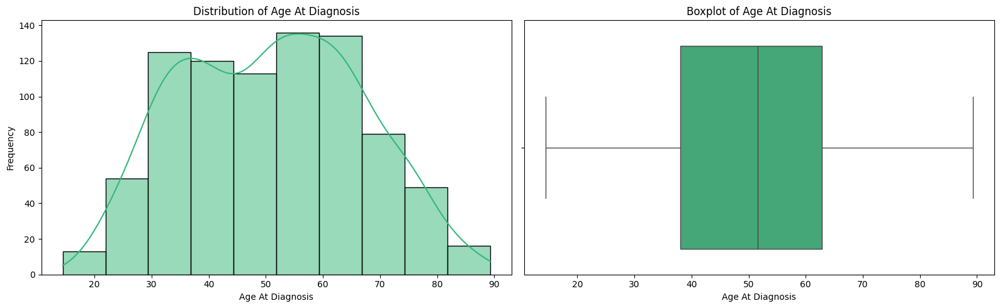
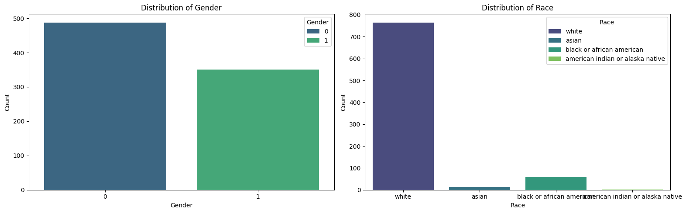
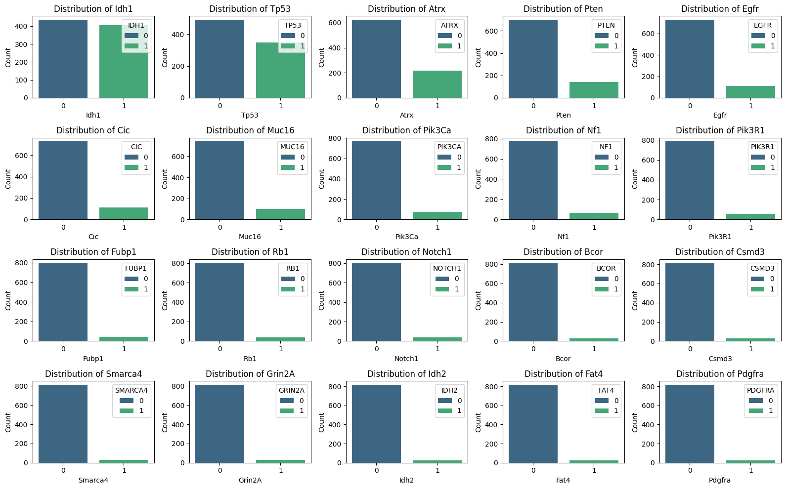
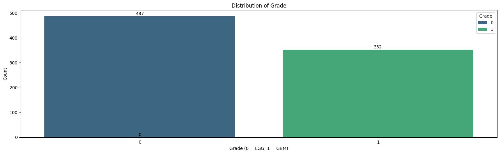

# Laporan Proyek Machine Learning - Christian Nathaniel

## Domain Proyek

Glioma merupakan jenis tumor otak primer yang paling umum dan dapat dibedakan menjadi dua kategori berdasarkan tingkat keganasan, yaitu Lower-Grade Glioma (LGG) dan Glioblastoma Multiforme (GBM). LGG cenderung tumbuh lebih lambat dan memiliki prognosis yang lebih baik, sementara GBM tergolong sebagai tumor yang sangat agresif dengan tingkat kematian yang tinggi. Identifikasi jenis glioma yang tepat sangat krusial karena berpengaruh langsung terhadap keputusan klinis seperti pilihan terapi, tingkat urgensi penanganan, dan estimasi kelangsungan hidup pasien.

Dalam praktiknya, penentuan klasifikasi LGG atau GBM memerlukan analisis molekuler dan genetik yang bersifat mahal serta tidak selalu tersedia, khususnya di rumah sakit dengan keterbatasan sumber daya. Oleh karena itu, terdapat kebutuhan untuk menciptakan pendekatan alternatif yang mampu memprediksi tipe glioma dengan akurasi tinggi hanya dari informasi klinis dasar (usia, jenis kelamin, ras) dan status mutasi gen yang umum.

Dengan memanfaatkan pendekatan machine learning, khususnya model klasifikasi, kita dapat membangun sistem prediktif yang mampu membedakan LGG dan GBM berdasarkan data yang lebih mudah diakses. Model ini tidak dimaksudkan untuk menggantikan diagnosa dokter atau pengujian molekuler, melainkan sebagai alat bantu awal untuk mempercepat proses screening dan memberikan gambaran awal dalam pengambilan keputusan medis.

Menurut [Ceccarelli et al. (2016)](https://www.cell.com/cell/fulltext/S0092-8674(15)01692-X?_returnURL=https%3A%2F%2Flinkinghub.elsevier.com%2Fretrieve%2Fpii%2FS009286741501692X%3Fshowall%3Dtrue), klasifikasi glioma berdasarkan kombinasi data klinis dan molekuler dapat meningkatkan akurasi diagnosis dan penentuan strategi pengobatan. Namun, akses terhadap uji molekuler yang menyeluruh masih terbatas secara global. Oleh karena itu, solusi berbasis machine learning dapat membantu mengatasi keterbatasan tersebut, khususnya di daerah dengan sumber daya terbatas.

Dengan menggunakan data dari proyek The Cancer Genome Atlas (TCGA), yaitu TCGA-LGG dan TCGA-GBM, kita dapat mengembangkan model prediktif berbasis supervised learning yang memanfaatkan fitur-fitur penting seperti usia, jenis kelamin, ras, serta status mutasi dari 20 gen yang paling sering bermutasi pada pasien glioma. Model ini diharapkan dapat memberikan prediksi awal dengan tingkat akurasi tinggi, sehingga mampu mendukung proses diagnosis awal sebelum dilakukan pengujian lebih lanjut.

**Referensi:**
- Ceccarelli, M., Barthel, F.P., Malta, T.M., et al. (2016). Molecular profiling reveals biologically discrete subsets and pathways of progression in diffuse glioma. Cell, 164(3), 550–563. https://doi.org/10.1016/j.cell.2015.12.028
- The Cancer Genome Atlas (TCGA) Research Network. (n.d.). Retrieved from: https://www.cancer.gov/ccg/research/genome-sequencing/tcga

## Business Understanding

### Problem Statements
- Bagaimana cara mengklasifikasikan jenis glioma (LGG atau GBM) pada pasien hanya berdasarkan informasi klinis dasar dan status mutasi genetik, tanpa bergantung pada pengujian molekuler lanjutan yang mahal dan terbatas ketersediaannya?
- Bagaimana membangun model prediktif yang dapat digunakan untuk membantu proses diagnosis awal glioma secara efisien, dengan mempertimbangkan keterbatasan sumber daya dan akses fasilitas kesehatan di berbagai daerah?
- Algoritma machine learning mana yang paling tepat dan efektif dalam mengklasifikasikan jenis glioma berdasarkan kombinasi fitur klinis dan genetik?

### Goals

Menjelaskan tujuan dari pernyataan masalah:
- Mengembangkan sistem klasifikasi berbasis machine learning untuk memprediksi apakah seorang pasien menderita LGG atau GBM, dengan hanya menggunakan data klinis (usia, jenis kelamin, ras) dan status mutasi 20 gen utama.
- Menyediakan alat bantu diagnosis awal berbasis data yang dapat digunakan di fasilitas kesehatan yang tidak memiliki kemampuan pengujian molekuler lengkap, sehingga mempercepat penanganan kasus dan meningkatkan efisiensi sumber daya.
- Mengevaluasi dan membandingkan performa beberapa algoritma klasifikasi seperti Logistic Regression, dan Random Forest untuk menentukan model terbaik berdasarkan metrik evaluasi yang sesuai.

### Solution statements
- Logistic Regression akan digunakan sebagai baseline model karena mudah diinterpretasikan dan memberikan insight awal terhadap kontribusi masing-masing fitur terhadap output. Model ini juga ringan secara komputasi dan cocok sebagai titik awal.
- Model berbasis tree seperti Random Forest akan digunakan untuk menangkap hubungan non-linear antara fitur dan label. Kedua model ini juga memiliki keunggulan dalam menangani data dengan banyak fitur kategorikal dan interaksi antar fitur.
- Untuk meningkatkan kinerja model terbaik, proses tuning hyperparameter akan dilakukan menggunakan GridSearchCV dan Stratified K-Fold Cross Validation, sehingga model dapat mencapai performa optimal dan generalisasi yang baik.
- Metrik evaluasi utama yang digunakan:
    - F1-Score (macro) – karena klasifikasi yang dilakukan bersifat biner dan distribusi label tidak seimbang (GBM cenderung lebih banyak).
    - Akurasi – sebagai metrik utama yang menunjukkan proporsi prediksi benar dari keseluruhan data, sangat penting untuk mengukur performa model secara umum.
    - Confusion matrix – digunakan untuk memahami jenis kesalahan prediksi secara rinci, terutama false positive dan false negative, yang sangat krusial dalam konteks aplikasi medis seperti deteksi glioma.

## Data Understanding
Dataset yang digunakan dalam proyek ini adalah ["Glioma Grading: Clinical and Mutation Features Dataset"](https://archive.ics.uci.edu/dataset/759/glioma+grading+clinical+and+mutation+features+dataset) yang tersedia secara publik di UCI Machine Learning Repository. Dataset ini dikembangkan berdasarkan data dari The Cancer Genome Atlas (TCGA), khususnya proyek TCGA-LGG dan TCGA-GBM, dan digunakan untuk mengklasifikasikan jenis glioma pada pasien (Lower Grade Glioma atau Glioblastoma Multiforme) berdasarkan informasi klinis dan status mutasi genetik.

### Variabel-variabel pada "Glioma Grading: Clinical and Mutation Features Dataset" adalah sebagai berikut:
Dataset ini terdiri dari **839 entri** data dengan total **23 fitur**:
- 3 fitur klinis
- 20 fitur molekuler berupa status mutasi genetik (bernilai 0 = tidak bermutasi, 1 = bermutasi).
- Target/label dari dataset ini adalah ‘Grade’ yang terdiri dari dua kelas:
    - 0 untuk Lower Grade Glioma (LGG)
    - 1 untuk Glioblastoma Multiforme (GBM)

| No | Nama Variabel        | Deskripsi                                                                                              |
|----|----------------------|--------------------------------------------------------------------------------------------------------|
| 1  | Grade                | Informasi kelas glioma (0 = LGG; 1 = GBM)                                                              |
| 2  | Gender               | Jenis kelamin (0 = laki-laki; 1 = perempuan)                                                           |
| 3  | Age_at_diagnosis     | Usia saat diagnosis                                                                                    |
| 4  | Race                 | Ras (0 = putih; 1 = hitam atau Afrika Amerika; 2 = Asia)                                               |
| 5  | IDH1                 | Isocitrate dehydrogenase (0 = tidak bermutasi; 1 = bermutasi)                                          |
| 6  | TP53                 | Tumor protein p53 (0 = tidak bermutasi; 1 = bermutasi)                                                 |
| 7  | ATRX                 | ATRX chromatin remodeler (0 = tidak bermutasi; 1 = bermutasi)                                          |
| 8  | PTEN                 | Phosphatase and tensin homolog (0 = tidak bermutasi; 1 = bermutasi)                                    |
| 9  | EGFR                 | Epidermal growth factor receptor (0 = tidak bermutasi; 1 = bermutasi)                                  |
| 10 | CIC                  | Capicua transcriptional repressor (0 = tidak bermutasi; 1 = bermutasi)                                 |
| 11 | MUC16                | Mucin 16, cell surface associated (0 = tidak bermutasi; 1 = bermutasi)                                 |
| 12 | PIK3CA               | Phosphatidylinositol-4,5-bisphosphate 3-kinase catalytic subunit alpha (0 = tidak bermutasi; 1 = bermutasi)   |
| 13 | NF1                  | Neurofibromin 1 (0 = tidak bermutasi; 1 = bermutasi)                                                   |
| 14 | PIK3R1               | Phosphoinositide-3-kinase regulatory subunit 1 (0 = tidak bermutasi; 1 = bermutasi)                    |
| 15 | FUBP1                | Far upstream element binding protein 1 (0 = tidak bermutasi; 1 = bermutasi)                            |
| 16 | RB1                  | RB transcriptional corepressor 1 (0 = tidak bermutasi; 1 = bermutasi)                                  |
| 17 | NOTCH1               | Notch receptor 1 (0 = tidak bermutasi; 1 = bermutasi)                                                  |
| 18 | BCOR                 | BCL6 corepressor (0 = tidak bermutasi; 1 = bermutasi)                                                  |
| 19 | CSMD3                | CUB and Sushi multiple domains 3 (0 = tidak bermutasi; 1 = bermutasi)                                  |
| 20 | SMARCA4              | SWI/SNF related, matrix associated, actin dependent regulator of chromatin, subfamily a, member 4 (0 = tidak bermutasi; 1 = bermutasi) |
| 21 | GRIN2A               | Glutamate ionotropic receptor NMDA type subunit 2A (0 = tidak bermutasi; 1 = bermutasi)                |
| 22 | IDH2                 | Isocitrate dehydrogenase 2 (0 = tidak bermutasi; 1 = bermutasi)                                        |
| 23 | FAT4                 | FAT atypical cadherin 4 (0 = tidak bermutasi; 1 = bermutasi)                                           |
| 24 | PDGFRA               | Platelet-derived growth factor receptor alpha (0 = tidak bermutasi; 1 = bermutasi)                     |

### Memeriksa Variabel-Variabel
1. Memeriksa Banyak data dan tipe-tipe datanya
Penting untuk mengetahui struktur dataset secara keseluruhan. Tahap ini bertujuan untuk memahami:
- Jumlah baris (records/observations)
- Jumlah kolom (features/attributes)
- Tipe data dari setiap kolom (numerik, kategorik, teks, tanggal, dsb)  
Dalam case ini cukup memeriksa menggunakan `df.info()`
2. Memeriksa Nilai Duplikat
Nilai duplikat dapat menyebabkan distorsi dalam analisis dan pelatihan model, khususnya jika duplikasi terjadi pada baris yang tidak semestinya identik.  
Dalam case ini kita menggunakan `df.duplicated().sum()`, yaitu memeriksa berapa banyak data duplikat.
3. Memeriksa Nilai Null
Nilai null (kosong) penting untuk diperhatikan karena dapat menyebabkan error atau hasil analisis yang bias.  
Dalam case ini menggunakan `df.insnull().sum()`, yaitu memeriksa berapa banyak nilai null pada data.

### Visualisasi Explorasi Data
1. Distribusi Usia Saat Diagnosis  
Gambar 1 menunjukkan distribusi usia pasien saat diagnosis (fitur `Age_at_diagnosis`) dalam bentuk histogram dan boxplot. Usia pasien bervariasi antara 15 hingga 90 tahun. Boxplot memperlihatkan bahwa tidak terdapat outlier ekstrem yang mencolok, menandakan distribusi usia yang relatif konsisten.

**Gambar 1.** Distribusi dan Boxplot Usia Saat Diagnosis

2. Distribusi Jenis Kelamin dan Ras  
Gambar 2 memperlihatkan distribusi frekuensi untuk fitur kategorikal `Gender` dan `Race`. Distribusi jenis kelamin cukup seimbang, dengan sedikit lebih banyak pasien laki-laki (0) dibanding perempuan (1). Sedangkan untuk ras, dominasi ditempati oleh kelompok ras White, diikuti oleh Black or African American, sementara kelompok minoritas termasuk Asian dan American Indian or Alaska Native.

**Gambar 2.** Distribusi Jenis Kelamin dan Distribusi Ras

3. Distribusi Fitur Mutasi Genetik  
Semua fitur mutasi genetik bersifat biner dengan nilai 0 (tidak mutasi) dan 1 (mutasi). Visualisasi pada Gambar 3 memperlihatkan bahwa sebagian besar fitur genetik memiliki proporsi kasus tidak mutasi yang lebih besar dibandingkan mutasi, menandakan bahwa mutasi gen relatif jarang terjadi pada beberapa gen dalam dataset ini.

**Gambar 3.** Distribusi Fitur Mutasi Genetik 

4. Distribusi Target (Grade)  
Target klasifikasi `Grade` terdiri dari dua kelas: Lower Grade Glioma (LGG) dan Glioblastoma Multiforme (GBM). Sebaran target diperlihatkan pada Gambar 4, dengan 487 pasien LGG dan 352 pasien GBM. Distribusi ini menunjukkan dataset relatif seimbang untuk keperluan tugas klasifikasi.

**Gambar 4.** Proporsi Kelas Target (Grade)

## Data Preparation
Pada tahap Data Preparation, beberapa proses penting dilakukan secara berurutan untuk memastikan kualitas data sebelum dilakukan pemodelan. Proses ini meliputi:
1. Penghapusan data duplikat
Dilakukan untuk menghilangkan entri data yang sama agar tidak memengaruhi hasil pelatihan model dan menghindari bias pada model.
2. Encoding fitur kategorikal
Fitur kategorikal seperti Race diubah menjadi nilai numerik menggunakan metode Label Encoding. Tahapan ini diperlukan karena sebagian besar algoritma machine learning membutuhkan input dalam bentuk numerik.
3. Pemilahan fitur dan target
Data dipisahkan menjadi variabel independen (fitur) dan variabel dependen (target) untuk memudahkan proses pelatihan dan evaluasi model.
4. Pembagian dataset menjadi data latih dan data uji
Data dibagi dengan proporsi 80:20 menggunakan teknik stratifikasi berdasarkan kelas target untuk menjaga distribusi kelas yang seimbang antara data latih dan uji.
5. Standardisasi fitur numerik kontinu
Fitur numerik di-standardisasi menggunakan StandardScaler agar memiliki skala yang seragam. Hal ini penting untuk meningkatkan performa model, khususnya algoritma yang sensitif terhadap skala fitur.

## Modeling
Tahapan modeling merupakan proses penerapan algoritma machine learning yang digunakan untuk menyelesaikan permasalahan klasifikasi grading glioma pada dataset. Pada tahap ini, dilakukan pemilihan, pelatihan, dan peningkatan model agar dapat menghasilkan prediksi yang akurat dan dapat diandalkan.

### Algoritma yang Digunakan
**1. Logistic Regression**  
Logistic Regression dipilih sebagai model baseline karena keunggulannya dalam hal interpretabilitas dan kemudahan implementasi. Model ini dapat memberikan insight awal terkait kontribusi masing-masing fitur terhadap probabilitas kelas target.

**Kelebihan:**
  - Model sederhana dan cepat dilatih.
  - Output koefisien mudah dipahami oleh praktisi dan stakeholder non-teknis.

**Kekurangan:**
  - Terbatas pada hubungan linear antar fitur dan target.
  - Sensitif terhadap fitur yang memiliki skala berbeda tanpa preprocessing.

**2. Random Forest**  
Random Forest digunakan sebagai model berbasis ensemble yang mampu menangkap hubungan non-linear dan interaksi kompleks antar fitur. Algoritma ini juga tangguh terhadap data dengan banyak fitur kategorikal dan mampu mengatasi overfitting dengan baik.

**Kelebihan:**
  - Mampu menangani data berdimensi tinggi dengan baik.
  - Tidak terlalu sensitif terhadap scaling fitur.
  - Memiliki mekanisme internal untuk menangani ketidakseimbangan data (melalui class weighting).
    
**Kekurangan:**
  - Model lebih kompleks dan kurang mudah diinterpretasikan dibanding Logistic Regression.
  - Memerlukan waktu komputasi lebih besar terutama untuk hyperparameter tuning.

### Proses Improvement dengan Hyperparameter Tuning
Untuk meningkatkan performa kedua model, dilakukan pencarian hyperparameter terbaik menggunakan **GridSearchCV** dengan strategi validasi silang **Stratified K-Fold (10 fold)** yang menjaga distribusi kelas agar tetap seimbang pada setiap split.
1. Pada Logistic Regression, parameter yang dituning meliputi:
- C (regularisasi) dengan nilai [0.01, 0.1, 1, 10].
- Jenis penalti: l1, l2, dan elasticnet.
- Solver: lbfgs, liblinear, dan saga.
- Max iterasi ditetapkan 5000 untuk menjamin konvergensi.

2. Pada Random Forest, parameter yang dituning meliputi:
- n_estimators (jumlah pohon): 100 dan 200.
- max_depth (kedalaman maksimal pohon): 3, 5, dan 10.
- min_samples_split (minimal sampel untuk split): 5 dan 10.
- min_samples_leaf (minimal sampel pada daun): 2 dan 4.
- class_weight diset ke 'balanced' untuk menangani ketidakseimbangan kelas.

GridSearchCV dijalankan secara paralel (n_jobs=-1) untuk efisiensi komputasi, dengan metrik evaluasi utama F1-score macro sebagai acuan pemilihan model terbaik.

### Pemilihan Model Terbaik
Setelah proses tuning, kedua model dievaluasi menggunakan metrik performa pada data uji. Meskipun akurasi dan F1-score keduanya cukup dekat (Gambar 5), pemilihan model terbaik didasarkan juga pada analisis confusion matrix (Gambar 6), terutama memperhatikan jumlah false negative (FN) yang sangat krusial dalam konteks medis.

**Gambar 5.** Perbandingan Metrik F1-score dan Akurasi pada kedua model

**Gambar 6.** Perbandingan analisis Confusion Matrix pada kedua model

**Model Random Forest** dipilih sebagai model terbaik karena mampu menurunkan jumlah false negative dibanding Logistic Regression, sehingga lebih meminimalkan risiko pasien positif glioma yang tidak terdeteksi. Dengan demikian, model ini memberikan keseimbangan optimal antara akurasi prediksi dan keselamatan pasien.

## Evaluation
Pada tahap evaluasi, digunakan beberapa metrik kunci untuk mengukur performa model klasifikasi, yaitu akurasi, precision, recall, dan F1-score. Pemilihan metrik ini didasarkan pada karakteristik data dan tujuan proyek yang mengedepankan prediksi yang seimbang dan aman dalam konteks medis.

### Penjelasan Metrik Evaluasi
- Akurasi adalah proporsi prediksi yang benar dari seluruh data yang diuji. Metrik ini memberikan gambaran umum seberapa baik model dalam mengklasifikasikan data secara keseluruhan.

$$
\text{Akurasi} = \frac{TP + TN}{TP + TN + FP + FN}
$$

- Precision mengukur proporsi prediksi positif yang benar-benar positif. Ini penting untuk mengetahui tingkat kepercayaan model saat memprediksi kelas tertentu.

$$
\text{Precision} = \frac{TP}{TP + FP}
$$
 
- Recall (atau sensitivitas) mengukur proporsi data positif yang berhasil terdeteksi oleh model. Metrik ini sangat krusial dalam konteks medis untuk meminimalkan kasus false negative.

$$
\text{Recall} = \frac{TP}{TP + FN}
$$
 
- F1-score adalah rata-rata harmonis dari precision dan recall, memberikan penilaian keseimbangan antara keduanya. F1-score sangat berguna saat data memiliki distribusi kelas yang tidak seimbang.

$$
F1 = 2 \times \frac{\text{Precision} \times \text{Recall}}{\text{Precision} + \text{Recall}}
$$

- Confusion Matrix merupakan tabel yang menunjukkan jumlah prediksi benar dan salah pada masing-masing kelas, terdiri dari:

    |                | Prediksi Negatif | Prediksi Positif |
    |----------------|------------------|------------------|
    | **Aktual Negatif** | True Negative (TN) | False Positive (FP) |
    | **Aktual Positif** | False Negative (FN) | True Positive (TP) |
​
### Hasil Evaluasi Projek
Berdasarkan hasil evaluasi pada data uji:

- Model Logistic Regression mencapai akurasi sebesar 86%, dengan precision, recall, dan F1-score masing-masing untuk kelas LGG sebesar 89%, 86%, dan 87%, serta untuk kelas GBM sebesar 81%, 86%, dan 84%. Hal ini menunjukkan model mampu melakukan prediksi dengan tingkat kepercayaan dan sensitivitas yang baik pada kedua kelas.

- Model Random Forest juga menunjukkan akurasi sebesar 86%, dengan precision, recall, dan F1-score untuk kelas LGG sebesar 93%, 82%, dan 87%, dan untuk kelas GBM sebesar 79%, 92%, dan 85%. Model ini menunjukkan performa yang seimbang dan sensitivitas yang tinggi terutama dalam mendeteksi kelas GBM.

- Analisis lebih lanjut menggunakan confusion matrix mengungkap bahwa Random Forest memiliki jumlah false negative (FN) yang lebih rendah dibanding Logistic Regression (6 dibandingkan 10 kasus). Mengingat konteks medis di mana false negative dapat berakibat fatal, Random Forest memberikan keunggulan dalam meminimalkan risiko pasien yang sakit tidak terdeteksi.

### Kesimpulan Evaluasi
Meskipun kedua model memiliki performa yang serupa dari segi akurasi dan F1-score, pertimbangan utama dalam memilih model terbaik adalah kemampuannya dalam meminimalkan **false negative** untuk menjaga keselamatan pasien. Oleh karena itu, **model Random Forest dipilih sebagai solusi terbaik pada proyek ini**.
